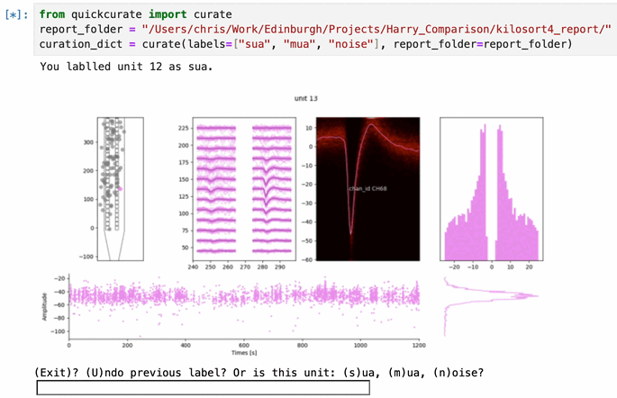

```
    (q)_(p)     
    \ . . /      Quick  
    =\ t /=        Curate
      \_/
```
A quick-fire, text-based curation tool which uses spikeinterface report folders.



Can either be used in Jupyter or Kitty.


## Installation

Using terminal, activate your virtual enviroment and navigate to where you like to keep your git repos (`cd path/to/my/git/folders`). In that folder, run

``` bash
git clone https://github.com/chrishalcrow/quickcurate.git
cd quickcurate
pip install .
```

If you're using Kitty, you may also need to do this:
``` bash
export MPLBACKEND='module://matplotlib-backend-kitty'
```
which adds the matplotlib backend to kitty; or the kitty frontend to matplotlib; or something like that.

## Running quick curate

### Jupyter

Open jupyter, and run

``` python
from quickcurate import curate
curation_dict = curate(
    labels=["good", "bad", "noise"], # or whichever labels you'd like
    report_folder = "path/to/folder/" # where your report is saved
    output_file = "where_to_save_the_curation_dict.json" # Optional
)
```

The output, `curation_dict`, is a dictionary of labels e.g. `curation_dict = {0: 'good', 1: 'good', 2: 'noise', ...}`. Alternatively, the labels can be found where you have saved `output_file`.


### Kitty

Open your Kitty terminal, and run

``` bash
quickcurate "path/to/spikeinterface/report/folder"
```

By default, your curation is saved in the report folder. You can specify somewhere else to save it as follows:

``` bash
quickcurate "report_folder" --output_file "my_output_folder/my_curation.json"
```

## Spikeinterface and curation

[Spikeinterface](https://github.com/SpikeInterface/spikeinterface) is spike-sorting software for ephys data. It has a great [export_report](https://github.com/SpikeInterface/spikeinterface) function, which generates a summary of your sorted data. You often want to curate this data: which units are single-neuron units, which are noise etc. To do this you often need intricate, interactive tools such as [phy](https://github.com/cortex-lab/phy), [sortingview](https://github.com/magland/sortingview?tab=readme-ov-file) or [spikeinterfacegui](https://github.com/SpikeInterface/spikeinterface-gui). Occassioanlly, you only need the simple stuff contained in the report. In this case `quickcurate` is your friend.
